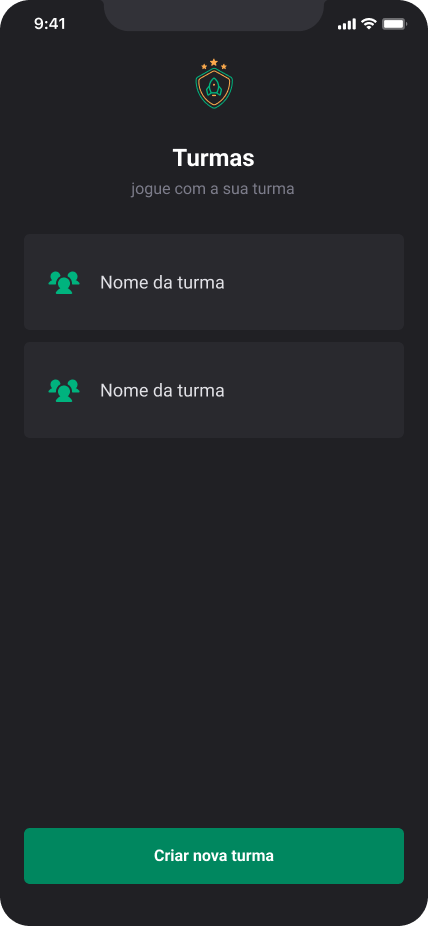
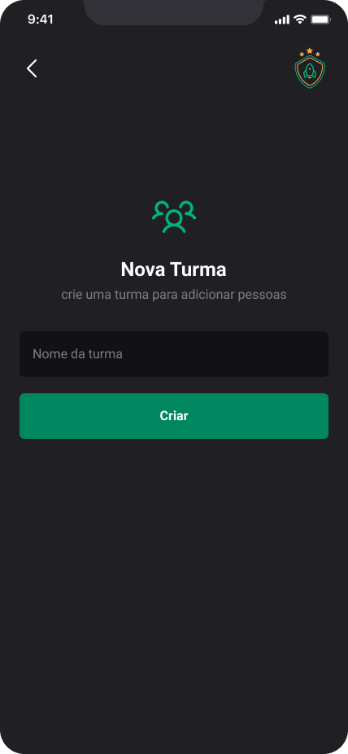
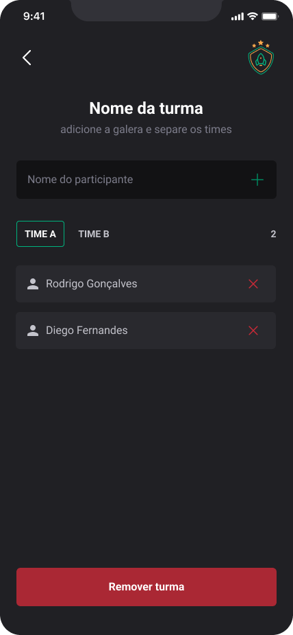

# Ignite Teams

---

### Esse projeto tem como proposta ajudar a organizar pessoas que se reúnem para jogar em turmas. É um aplicativo com navegação em pilhas onde é possível cadastrar/remover turmas/membros do time e armazenar essas informações no armazenamento local do aparelho, preservando os dados mesmo que o app seja fechado. Seguimos um guia de estilo para implementar nosso tema no Styled Components a fim de manter um padrão em todo o app.

### [Design Figma](https://www.figma.com/file/D5W2HdNXMDCZGaRLUDLwhX/Ignite-Teams-(Community)?node-id=37%3A6&t=srAuJkgZnPwNKPbh-0)

  