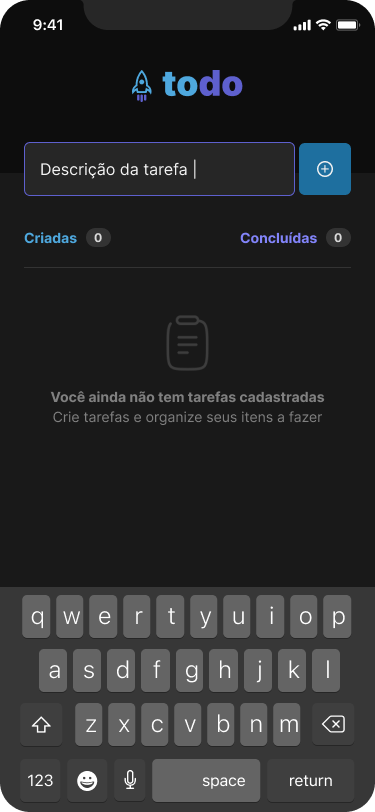
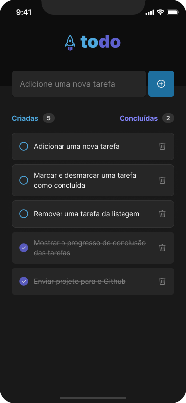

  

### 🚀 React Native 1st challenge

---

## Desafio 01 - Praticando os conceitos do React Native  

### 🧠 Sobre o desafio

Nesse desafio, desenvolvemos uma aplicação de controle de tarefas no estilo **to-do list**, que contém as seguintes funcionalidades:
- Adicionar uma nova tarefa
- Marcar e desmarcar uma tarefa como concluída
- Remover uma tarefa da listagem
- Mostrar o progresso de conclusão das tarefas

Apesar de poucas funcionalidades, nesse projeto estudamos os conceitos de:
- Estados
- Imutabilidade do estado
- Listas e chaves no React Native
- Propriedades
- Componentização

### 🌼 Layout da aplicação

     

### 🔨 Ferramentas

### 🚀 Deploy
